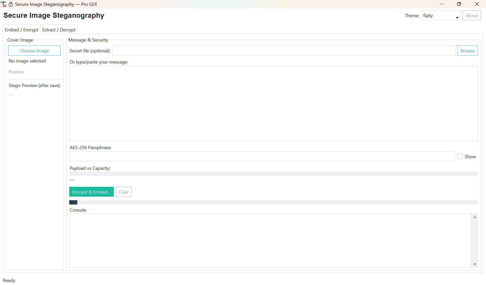
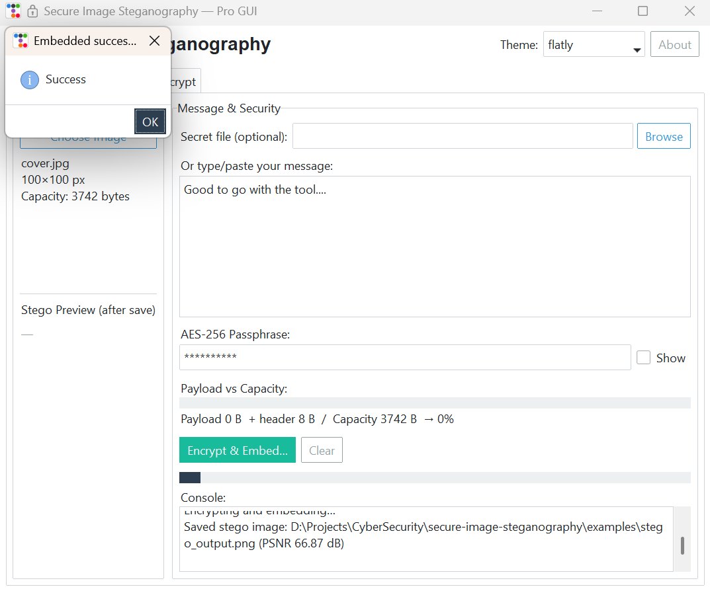

# Secure-Image-Steganography
# 🔐 Secure Image Steganography (AES-256 + LSB)


Hide and protect secret messages inside images using **AES-256 encryption** and **LSB steganography**.  
A final year cybersecurity project with both **GUI (Tkinter + ttkbootstrap)** and **CLI** support.  

---

## 📸 Screenshots  

### GUI – Main Window  


### Message Embedding Example  


---

## ✨ Features  
- 🔒 **AES-256 Encryption** – Strong cryptography for confidentiality  
- 🖼️ **LSB Steganography** – Hide encrypted data inside images  
- 🎨 **Modern GUI** – Dark/light themes with `ttkbootstrap`  
- 💻 **CLI Support** – For terminal-based workflows  
- 📊 **PSNR Analysis** – Measure image quality after embedding  
- ✅ **Unit Tests** – For both crypto & stego modules  

---

## 🛠️ Tech Stack  
`Python` · `PyCryptodome` · `Pillow` · `Tkinter` · `ttkbootstrap` · `NumPy` · `pytest`

---

## 🚀 Quick Start  

```bash
# Clone the repository
git clone https://github.com/your-username/Secure-Image-Steganography.git
cd Secure-Image-Steganography

# Install dependencies
pip install -r requirements.txt

# Run GUI
python src/gui_pro.py

# Run CLI
python src/cli.py --help


Secure-Image-Steganography/
│── src/
│   ├── crypto.py       # AES-256 encryption & decryption
│   ├── stego.py        # LSB embedding & extraction
│   ├── utils.py        # PSNR calculation & helpers
│   ├── gui_pro.py      # Advanced GUI
│   └── cli.py          # Command-line interface
│
│── tests/
│   ├── test_crypto.py  # Tests for crypto module
│   └── test_stego.py   # Tests for stego module
│
│── requirements.txt    # Dependencies
│── README.md           # Documentation


📊 Workflow

1️⃣ Select a cover image
2️⃣ Enter your secret message + key
3️⃣ Message → AES-256 encrypted → embedded via LSB
4️⃣ Extract & decrypt → recover the original message securely

🔮 Future Scope

📹 Video & audio steganography
🤖 AI-powered stego detection resistance
☁️ Cloud & mobile app integration


📜 License

This project is licensed under the MIT License – free to use, modify, and distribute.
